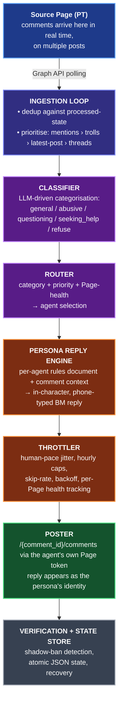

# Chart preview (delete after review)

```mermaid
flowchart TD
    A["<b>Source Page (PT)</b><br/>comments arrive here in real time,<br/>on multiple posts"]
    B["<b>INGESTION LOOP</b><br/>• dedup against processed-state<br/>• prioritise: mentions › trolls › latest-post › threads"]
    C["<b>CLASSIFIER</b><br/>LLM-driven categorisation:<br/>general / abusive / questioning / seeking_help / refuse"]
    D["<b>ROUTER</b><br/>category + priority + Page-health<br/>→ agent selection"]
    E["<b>PERSONA REPLY ENGINE</b><br/>per-agent rules document + comment context<br/>→ in-character, phone-typed BM reply"]
    F["<b>THROTTLER</b><br/>human-pace jitter, hourly caps,<br/>skip-rate, backoff, per-Page health tracking"]
    G["<b>POSTER</b><br/>/{comment_id}/comments via the agent's own Page token<br/>reply appears as the persona's identity"]
    H["<b>VERIFICATION + STATE STORE</b><br/>shadow-ban detection,<br/>atomic JSON state, recovery"]

    A -->|"Graph API polling"| B
    B --> C
    C --> D
    D --> E
    E --> F
    F --> G
    G --> H

    classDef source fill:#1e3a8a,stroke:#60a5fa,stroke-width:2px,color:#fff
    classDef ingest fill:#312e81,stroke:#818cf8,stroke-width:2px,color:#fff
    classDef brain fill:#581c87,stroke:#c084fc,stroke-width:2px,color:#fff
    classDef control fill:#7c2d12,stroke:#fb923c,stroke-width:2px,color:#fff
    classDef action fill:#14532d,stroke:#4ade80,stroke-width:2px,color:#fff
    classDef state fill:#374151,stroke:#9ca3af,stroke-width:2px,color:#fff

    class A source
    class B ingest
    class C,D brain
    class E,F control
    class G action
    class H state
```
