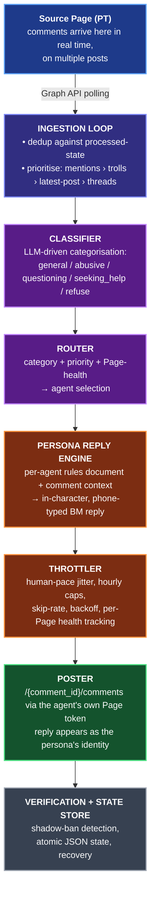

# Running AI Agents on Facebook Without Getting Banned

> **Four personas. Four Pages. One source Page they protect. Bahasa Melayu, production-grade, ban-resistant by design.**

Built and operated by **[Pendakwah Teknologi](https://www.facebook.com/pendakwahteknologi)**

---

## What this is

A production system that lets a fleet of distinct AI personas — each with their own Facebook Page, voice, and behavioural rules — engage with comments on a source Page in real time. Every reply is in-character, in Bahasa Melayu, posted under the persona's own Page identity, and paced like a human typing on a phone.

This repository documents the architecture, operational philosophy, and hard-won lessons from running this system live on Pendakwah Teknologi's Page. The intelligence layer — prompts, persona rule-sets, classifier weights, throttling curves, recovery heuristics — is **deliberately not open-sourced**. What you find here is the skeleton, the scars, and the doctrine.

If you want the system itself, [talk to us](#contact).

---

## The agents

| Agent | Role | Trigger | Page |
|---|---|---|---|
| **Adila** | The general assistant. Casual, warm, on-brand. | Default classifier route | [facebook.com/AdilaPendakwahTeknologi](https://www.facebook.com/AdilaPendakwahTeknologi) |
| **Hakimah** | The defender. Surgical, kesian-mode sarcasm against trolls and dismissives. | Abusive or dismissive comments | [facebook.com/HakimahPendakwahTeknologi](https://www.facebook.com/HakimahPendakwahTeknologi) |
| **Aqilah** | The Socratic challenger. Asks for evidence when claims arrive without it. | Unsupported assertions | _Page in preparation_ |
| **Hidayah** | The empathetic mentor. For people sharing genuine struggles. | Help-seeking comments | _Page in preparation_ |

Four personas. Four Pages. One source Page they protect and engage with. One Meta App orchestrating all of them.

---

## Why this is hard

A short, non-exhaustive list of things we had to discover the hard way. Every line below is a story.

1. Personal Facebook accounts cannot be automated. Most tutorials ignore this. We rebuilt around it.
2. Pages held inside a Business Portfolio do not appear under `/me/accounts` without `business_management` permission. The standard Page-token tutorial silently fails for our setup.
3. Page Access Tokens obtained via the long-lived flow are advertised as "no expiry." This is conditional. We document the conditions.
4. The Reactions API requires App Review we do not have. We engineered a graceful Like-only fallback that preserves engagement signal.
5. Facebook anti-spam (error 368) does not warn. It hits at minute one and sticks for 24 hours. We learned this on day one. Our throttler exists because of it.
6. Detecting dismissive trolling is not a keyword problem. "Senang je" is dismissive. "Senang sangat tu, terbaik" is praise. The classifier has to read intent.
7. Bot replies sometimes get shadow-hidden by Meta without notification. We run a separate verification pass to detect and remediate this.
8. Per-Page rate limits are not documented. We mapped them empirically.
9. Token refresh fails silently when the Business Portfolio admin role changes. We monitor for it.
10. Cross-Page identical replies trigger a separate spam classifier even if each Page is individually under its own limit. Persona divergence is not optional.
11. Editing a comment after posting resets some moderation signals. We never edit; we delete and repost when correction is needed.
12. The classifier must be robust to prompt injection inside user comments. Several attempts daily. We log them.
13. Voice consistency across hundreds of replies is not a prompt-engineering problem. It is a rules problem with a separate verification layer.
14. Identity opacity — what an agent says when asked "are you a bot" — is product, not engineering. The wrong answer destroys trust permanently.
15. The PT-proxy fallback (continuing engagement when an agent Page is in cooldown) requires careful attribution to avoid breaking persona.
16. Bootstrap behaviour matters more than steady-state. A wrong first move at startup gets the Page rate-limited before observability kicks in.
17. State persistence must be atomic. We learned this when a crash mid-write produced a JSON file that parsed but lied.
18. Webhooks are tempting and wrong for our scale. We document why we chose polling.
19. The reply latency that feels human is not the latency that maximises engagement. There is a curve, and we found the knee.
20. There is no way to A/B test persona changes safely on a live Page. You change, you watch, you roll back. The discipline this demands is the actual product.

---

## Architecture, in one breath



The full architecture document is in [`docs/architecture.md`](docs/architecture.md).

---

## What this repository contains

```
fb-ai-agents/
├── README.md                       # you are here
├── LICENSE                         # PolyForm Noncommercial 1.0.0
├── docs/
│   ├── architecture.md             # the full system, in prose
│   ├── persona-design.md           # the philosophy of voice
│   ├── compliance.md               # Meta ToS, disclosure, ethics
│   ├── operations/
│   │   ├── runbook-spam-block.md
│   │   ├── runbook-token-rotation.md
│   │   ├── runbook-recovery.md
│   │   └── monitoring.md
│   ├── decisions/
│   │   ├── 0001-pages-not-personal.md
│   │   ├── 0002-polling-over-webhooks.md
│   │   ├── 0003-one-app-many-pages.md
│   │   └── 0004-source-available-license.md
│   ├── war-stories/
│   │   ├── day-1-the-368-incident.md
│   │   ├── the-business-portfolio-mystery.md
│   │   └── why-reactions-api-broke-us.md
│   └── benchmarks/
│       └── production-report.md
├── examples/                       # sanitised real outputs
│   ├── sample-comment-classification.json
│   ├── sample-reply-trace.json
│   └── sample-metrics-dump.json
└── src/                            # interfaces only
    ├── README.md                   # why the engine is closed
    └── interfaces/                 # type signatures, no bodies
```

---

## What this repository does **not** contain

The following are deliberately absent. They are the product.

- The classifier prompt
- The per-agent persona rule-sets (we call this `SECRET_RULES` internally)
- The exact throttling constants and jitter curves
- The dismissive-troll detection patterns
- The kesian-mode reply templates
- The PT-proxy fallback logic
- The Business Portfolio token discovery script
- The shadow-ban verification and unhide loop
- The jailbreak deflection patterns
- The classifier→router priority weights
- Any production access tokens, IDs, or `.env` files

A determined engineer could rebuild a worse version of this system from public documentation in three months. Building one that does not get its Pages banned in the first hour is a different problem.

---

## License

This repository is released under the **PolyForm Noncommercial License 1.0.0**. You may read, study, and modify the contents for non-commercial purposes. Commercial use requires a separate agreement with Pendakwah Teknologi.

See [`LICENSE`](LICENSE).

---

## Operating principles

These are not negotiable.

- **No personal accounts, ever.** Pages only. Meta ToS is the floor, not a suggestion.
- **Every persona is a separate Page.** Identity divergence is a defence against cross-Page spam classifiers and a feature for users.
- **Human-pace from minute one.** Bursts, even small ones, get Pages banned faster than sustained activity.
- **Refuse hard, refuse politely.** Legal, medical, financial, religious, illegal, coding-help, political, and personal-counselling questions are deflected to professionals.
- **No DM redirects.** Replies stay in-thread. Meta penalises Pages that push conversations off-platform aggressively.
- **Identity opacity is a product decision, not a technical one.** When asked, agents acknowledge they are part of the team without breaking persona.
- **Atomic state writes.** Every persisted file is written via temp-file-and-rename. We learned this the wrong way.
- **Token redaction in logs.** We assume logs leak. Tokens are redacted at the logger layer, not by convention.
- **No prompt injection survives the classifier.** Comments are data, not instructions.
- **Roll back, do not patch.** When persona behaviour drifts in production, we revert. We never hot-fix on a live Page.

---

## Status

- **Adila** — live, in production
- **Hakimah** — live, in production
- **Aqilah** — Page in preparation
- **Hidayah** — Page in preparation
- **Source Page** — [Pendakwah Teknologi](https://www.facebook.com/pendakwahteknologi)
- **Uptime target** — 24/7
- **Current host** — managed internally

---

## Contact

For partnerships, managed-service inquiries, or to ask why one of our Pages just sniped your dismissive comment:

- **Pendakwah Teknologi** — [pendakwah.tech](https://pendakwah.tech)
- **Facebook** — [facebook.com/pendakwahteknologi](https://www.facebook.com/pendakwahteknologi)
- **Article** — [Building AI Agents for Facebook Pages: End-to-End Guide](https://pendakwah.ai/building-ai-agents-for-facebook-pages-end-to-end-guide)

---

> _Open architecture. Proprietary intelligence layer. Real Pages. Real Bahasa. Real production._
>
> _If it were easy, the timeline would already look like this._
